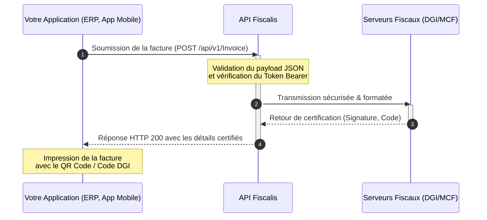

# Bienvenue sur la documentation de l'API Fiscalis

Bienvenue sur le portail développeur d'**Fiscalis**. Cette documentation a été conçue pour vous accompagner pas à pas dans l'intégration de nos services au sein de vos propres applications, ERP ou systèmes d'information.

## Qu'est-ce qu'Fiscalis ?

Fiscalis est une plateforme SaaS robuste qui agit comme un middleware intelligent. Notre API RESTful permet aux développeurs de connecter facilement leurs systèmes de facturation (comme Dolibarr, Odoo, ou des applications sur mesure) aux exigences de **conformité fiscale et de facturation normalisée**. 

Plutôt que de gérer la complexité cryptographique et les règles métiers imposées par les autorités fiscales (DGI, MCF), Fiscalis s'occupe de tout et vous renvoie une réponse claire et structurée.

## Cas d'usage principaux

- **Certification en temps réel :** Soumettez vos factures via l'API et recevez instantanément les codes de certification fiscaux.
- **Centralisation & Historique :** Conservez un registre immuable et sécurisé de toutes vos opérations de facturation pour un reporting simplifié.
- **Agnosticisme technologique :** Que vous développiez en C#, Python, JavaScript ou que vous intégriez un ERP existant, notre API s'adapte à votre stack.

## Comment fonctionne l'intégration ?

Voici un aperçu global du flux de données entre votre système, Fiscalis et l'administration fiscale :



:::info La philosophie Fiscalis
Nous avons conçu cette API pour qu'elle soit la plus developer-friendly possible : des endpoints prévisibles, une authentification standard par Bearer Token, et des messages d'erreur descriptifs pour faciliter votre débogage.
:::

Premiers pas (Quickstart)

Prêt à coder ? Suivez ces trois étapes pour réaliser votre premier appel API en moins de 5 minutes.
### 1. Récupérer votre clé API

Pour communiquer avec nos serveurs, vous avez besoin d'un jeton d'accès.

Connectez-vous à votre tableau de bord Fiscalis.
- https://fiscalis.azurewebsites.net pour la production
- http://87.106.10.40/ pour les tests

Naviguez vers la section Dashboard > Clés API.

Générez une nouvelle clé pour l'environnement de Sandbox (Test).

### 2. Configurer votre client HTTP

Toutes les requêtes adressées à l'API Fiscalis doivent inclure votre clé dans l'en-tête d'autorisation. L'API accepte et renvoie exclusivement du format JSON.

```
Authorization: Bearer VOTRE_CLE_API_ICI
Content-Type: application/json
Accept: application/json
```

Si tout est bien configuré, vous recevrez une réponse de statut 200 OK confirmant que vous êtes prêt à commencer l'intégration !

:::tip Prochaine étape
Maintenant que vous êtes connecté, découvrez comment sécuriser vos requêtes et gérer vos environnements dans la section Authentification & Sécurité.
:::