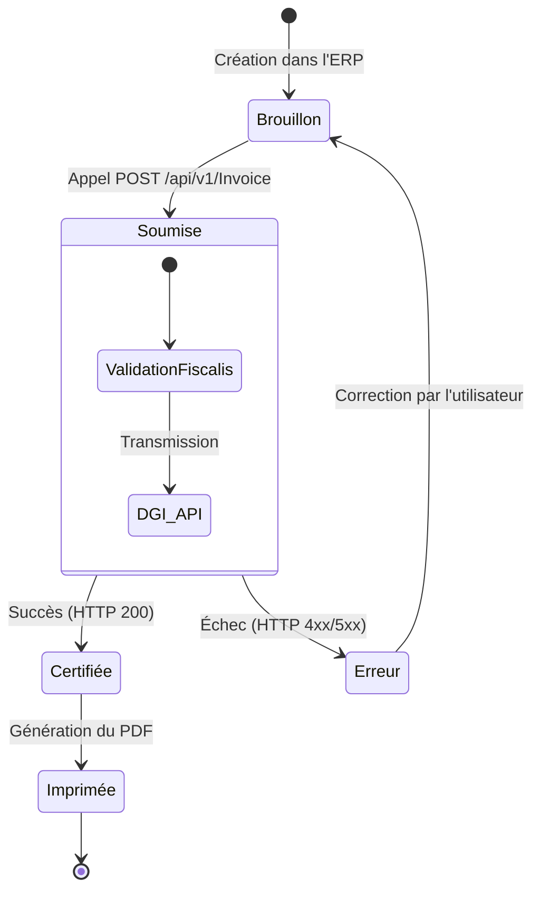

# Guides & Tutoriels 

Cette section vous accompagne dans la compréhension des flux métiers de la plateforme Fiscalis. Vous y trouverez les bonnes pratiques pour intégrer notre API de manière optimale dans votre application métier ou votre ERP.

## 1. Le Cycle de Vie d'une Facture Normalisée

L'intégration d'Fiscalis ne se limite pas à un simple appel réseau. Elle s'inscrit dans le processus de vente de votre application. Voici le cycle de vie standard que nous recommandons d'implémenter.

### Diagramme d'état de la facture

### Étape 1 : Préparation et Brouillon

L'utilisateur crée sa facture dans votre système. À ce stade, il s'agit d'un brouillon. Selon le type d'opération, vous définirez le type de facture : une facture de vente standard (`FV`) ou une facture d'avoir (`FA`).
### Étape 2 : Soumission à Fiscalis

Dès que la facture est validée commercialement par l'utilisateur, votre système effectue un appel `POST /api/v1/Invoice`. L'API Fiscalis prend alors le relais pour dialoguer avec les serveurs fiscaux.
### Étape 3 : Sauvegarde des Éléments de Sécurité

En cas de succès, Fiscalis vous retourne un objet JSON contenant les éléments de sécurité obligatoires générés par la DGI : le Code DEF/DGI (`codeDEFDGI`), les données du QR Code (`qrCode`), les compteurs (`counters`), et le NID de l'e-MCF (`nim`).

:::danger Obligation de Stockage
Vous devez impérativement sauvegarder ces champs dans la base de données de votre ERP (ex: dans des champs personnalisés ou des extrafields sous Dolibarr) en les liant à la facture correspondante.
:::
### Étape 4 : Impression et Affichage

Lors de la génération du PDF pour le client final, votre système doit obligatoirement faire figurer :
1. Le code QR généré à partir de la chaîne `qrCodeData`.
2. Le `codeDEFDGI` en clair.
3. Les compteurs de la machine (`counters`).
4. Le numéro de la machine (`nim`).

## 2. Comprendre la Tarification et les Quotas

L'API Fiscalis est conçue pour être équitable et adaptée au volume d'activité réel des entreprises.
Comptage par Factures Annuelles

Contrairement aux systèmes matériels traditionnels, la tarification de notre SaaS ne se base pas sur le nombre de terminaux ou de caisses enregistreuses connectées. Le modèle est basé sur un quota de factures annuelles (ex: Forfait Start, Forfait Grow).

- Chaque appel réussi à `POST /api/v1/Invoice` (statut HTTP 200) décrémente votre quota annuel d'une unité.
- Les appels échoués (erreurs de validation, rejets DGI) ne sont pas comptabilisés.

Que se passe-t-il si le quota est atteint ?

Si une organisation atteint la limite de son forfait annuel, l'API renverra un code d'erreur `429 Too Many Requests`. Il est conseillé d'intercepter ce code dans votre code client (ex: via un `DelegatingHandler` en C#/.NET 9.0) pour afficher un message invitant l'administrateur à faire évoluer son abonnement depuis le tableau de bord Fiscalis.
Le rôle de la table `LogInvoices`

Pour garantir une transparence totale sur la consommation de votre forfait et assurer la traçabilité en cas d'audit fiscal, chaque certification réussie est inscrite dans le registre immuable LogInvoices.
Même si vous supprimez ou annulez la facture dans votre propre système par la suite, cette ligne de log persistera du côté d'Fiscalis.