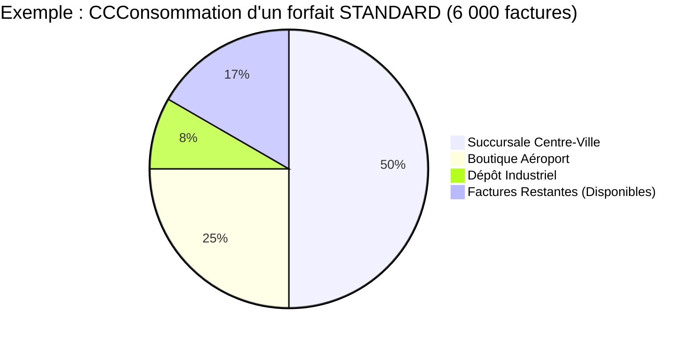

# Comprendre votre abonnement Fiscalis

Bienvenue sur Fiscalis ! Notre mission est de simplifier votre conformité fiscale en RDC. Pour accompagner la croissance de votre entreprise, nous avons conçu une tarification **basée sur votre volume d'activité réel**, et non sur le nombre de terminaux que vous possédez.

Voici tout ce que vous devez savoir sur le fonctionnement de votre abonnement, vos quotas, et la gestion de vos factures.

---

## 1. Nos Forfaits Annuels

Fiscalis propose quatre forfaits adaptés à la taille de votre entreprise. Chaque forfait inclut un volume de factures certifiées par an.

| Offre | Abonnement Annuel | Frais d'installation | Volume de factures inclus | Terminaux (MCF) inclus |
| :--- | :--- | :--- | :--- | :--- |
| **ESSENTIAL** | 300,00 $ | 300,00 $ | **600** factures/an | 1 |
| **STANDARD** | 950,00 $ | 300,00 $ | **6 000** factures/an | **Illimité** |
| **PERFORMANCE** | 2 400,00 $ | 500,00 $ | **40 000** factures/an | **Illimité** |
| **GRAND COMPTE** | Sur devis | > 1 000,00 $ | **> 40 000** factures/an | **Illimité** |

:::info Frais d'installation (Optionel)
Les frais d'installation sont payés une seule fois lors de la création de votre compte. Ils couvrent le paramétrage de votre espace, la génération de vos clés de sécurité Fiscalis.
:::

---

## 2. Le super-pouvoir du NIF : La Mutualisation

C'est l'un des plus grands avantages de Fiscalis. Votre abonnement est rattaché à votre **Numéro d'Identification Fiscale (NIF)**, et non à une machine physique.

**Qu'est-ce que cela signifie pour vous ?**
Si vous possédez plusieurs succursales ou points de vente, vous n'avez pas besoin de payer un abonnement pour chacun d'entre eux ! À partir du forfait **STANDARD**, vous pouvez connecter un nombre **illimité** de caisses ou de logiciels. Toutes vos succursales puiseront simplement dans le même "pot commun" de factures.

## 3. Que se passe-t-il si je dépasse mon quota ? (Les Recharges)

Votre entreprise grandit plus vite que prévu ? Félicitations ! Fiscalis ne vous obligera jamais à racheter un abonnement complet en cours d'année.

Si vous atteignez votre limite annuelle, votre logiciel vous en informera. Vous pourrez alors acheter une Recharge (Top-Up) pour continuer à facturer immédiatement :

- Si vous êtes en ESSENTIAL : + 500 factures pour 80 $
- Si vous êtes en STANDARD : + 1 000 factures pour 130 $
- Si vous êtes en PERFORMANCE : + 5 000 factures pour 600 $

### Comment faire la demande ?
Directement depuis le portail, un bouton vous permettra de demander une recharge. Une fois le paiement effectué auprès de notre partenaire commercial (Altairon), vos factures seront débloquées instantanément.

## 4. Le Report de Factures : Ne perdez jamais ce que vous avez payé

Contrairement à de nombreux services, chez Fiscalis, vos factures non consommées ne sont pas perdues !

Si vous arrivez à la fin de votre année d'abonnement et qu'il vous reste des factures, nous les transférons automatiquement sur votre année suivante lors de votre renouvellement.

:::tip Exemple concret de report (Rollover)
Vous avez souscrit au forfait STANDARD (6 000 factures). À la date anniversaire de votre contrat, vous n'en avez consommé que 4 500.
Lors de votre réabonnement annuel, les 1 500 factures restantes sont ajoutées à votre nouveau forfait. Vous commencerez donc votre nouvelle année avec 7 500 factures disponibles !
:::

*Note : En cas de passage vers un forfait inférieur (Downgrade), le report est plafonné à la taille de votre nouveau forfait.*

## 5. Comment renouveler ou changer de forfait ?

- **Renouvellement** : Trente (30) jours avant l'expiration de votre licence, une notification apparaîtra dans votre système. Il vous suffira de valider le renouvellement pour prolonger votre accès d'un an et profiter du report de vos factures.

- **Changement de forfait (Upgrade)** : Vous pouvez passer à un forfait supérieur à tout moment (par exemple, d'Essential à Standard) si votre volume d'activité l'exige. Toutes vos factures non utilisées seront intégralement conservées et ajoutées à votre nouveau solde.

Pour toute question commerciale ou demande d'évolution de votre offre, l'équipe d'**Altairon** est à votre entière disposition.