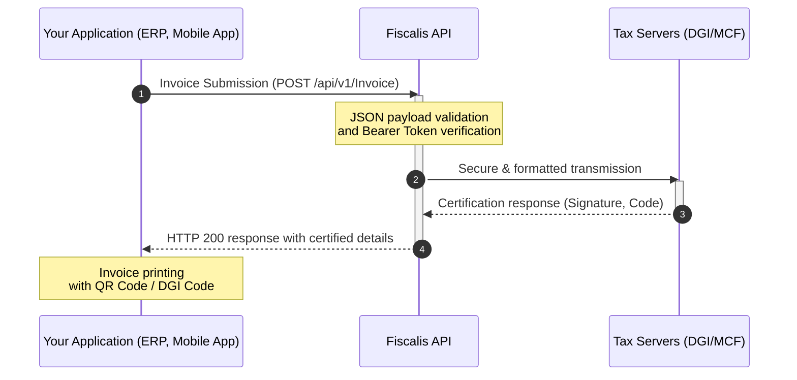

# Welcome to the Fiscalis API Documentation

Welcome to the **Fiscalis** developer portal. This documentation has been designed to guide you step-by-step through the integration of our services into your own applications, ERPs, or information systems.

## What is Fiscalis?

Fiscalis is a robust SaaS platform that acts as an intelligent middleware. Our RESTful API allows developers to easily connect their billing systems (such as Dolibarr, Odoo, or custom applications) to the requirements of **tax compliance and standardized invoicing**.

Rather than managing the cryptographic complexity and business rules imposed by tax authorities (DGI, MCF), Fiscalis handles everything and returns a clear and structured response to you.

## Main Use Cases

- **Real-time Certification:** Submit your invoices via the API and instantly receive tax certification codes.
- **Centralization & History:** Maintain an immutable and secure record of all your invoicing operations for simplified reporting.
- **Technological Agnosticism:** Whether you are developing in C#, Python, JavaScript, or integrating an existing ERP, our API adapts to your stack.

## How does the integration work?

Here is a global overview of the data flow between your system, Fiscalis, and the tax administration:



:::info The Fiscalis Philosophy
We designed this API to be as developer-friendly as possible: predictable endpoints, standard authentication via Bearer Token, and descriptive error messages to facilitate your debugging.
:::

Getting Started (Quickstart)

Ready to code? Follow these three steps to make your first API call in less than 5 minutes.
### 1. Retrieve your API key

To communicate with our servers, you need an access token.

Log in to your Fiscalis dashboard.
- https://fiscalis.azurewebsites.net for production
- http://87.106.10.40/ for testing

Navigate to the Dashboard > API Keys section.

Generate a new key for the Sandbox (Test) environment.

### 2. Configure your HTTP client

All requests to the Fiscalis API must include your key in the Authorization header. The API exclusively accepts and returns JSON format.

```
Authorization: Bearer YOUR_API_KEY_HERE
Content-Type: application/json
Accept: application/json
```

If everything is configured correctly, you will receive a 200 OK status response confirming that you are ready to start the integration!

:::tip Next Step
Now that you are connected, learn how to secure your requests and manage your environments in the Authentication & Security section.
:::
