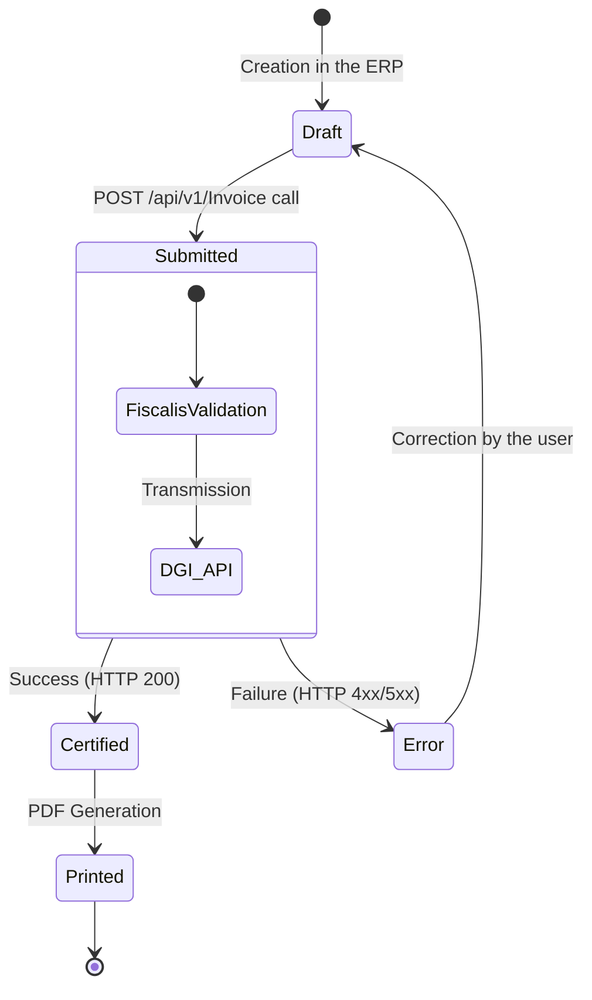

# Guides & Tutorials 

This section helps you understand the business flows of the Fiscalis platform. You will find best practices for optimally integrating our API into your business application or ERP.

## 1. The Lifecycle of a Standardized Invoice

The integration of Fiscalis is not limited to a simple network call. It is part of your application's sales process. Here is the standard lifecycle that we recommend implementing.

### Invoice Status Diagram

### Step 1: Preparation and Draft

The user creates their invoice in your system. At this stage, it is a draft. Depending on the type of operation, you will define the type of invoice: a standard sales invoice (`FV`) or a credit note (`FA`).
### Step 2: Submission to Fiscalis

As soon as the invoice is commercially validated by the user, your system makes a `POST /api/v1/Invoice` call. The Fiscalis API then takes over to communicate with the tax servers.
### Step 3: Saving Security Elements

In case of success, Fiscalis returns a JSON object containing the mandatory security elements generated by the DGI: the DEF/DGI Code (`codeDEFDGI`), the QR Code data (`qrCode`), the counters (`counters`), and the e-MCF's NID (`nim`).

:::danger Storage Obligation
You must imperatively save these fields in your ERP's database (e.g., in custom fields or extrafields under Dolibarr) by linking them to the corresponding invoice.
:::
### Step 4: Printing and Display

When generating the PDF for the end customer, your system must obligatorily include:
1. The QR code generated from the `qrCodeData` string.
2. The `codeDEFDGI` in clear text.
3. The machine's counters (`counters`).
4. The machine number (`nim`).

## 2. Understanding Pricing and Quotas

The Fiscalis API is designed to be fair and adapted to the real business volume of companies.
Annual Invoice Counting

Unlike traditional hardware systems, our SaaS pricing is not based on the number of connected terminals or cash registers. The model is based on an annual invoice quota (e.g., Start Plan, Grow Plan).

- Each successful call to `POST /api/v1/Invoice` (HTTP status 200) decrements your annual quota by one unit.
- Failed calls (validation errors, DGI rejections) are not counted.

What happens if the quota is reached?

If an organization reaches its annual plan limit, the API will return a `429 Too Many Requests` error code. It is advisable to intercept this code in your client code (e.g., via a `DelegatingHandler` in C#/.NET 9.0) to display a message inviting the administrator to upgrade their subscription from the Fiscalis dashboard.
The role of the `LogInvoices` table

To ensure full transparency on the consumption of your plan and to ensure traceability in the event of a tax audit, each successful certification is recorded in the immutable LogInvoices register.
Even if you delete or cancel the invoice in your own system later, this log line will persist on the Fiscalis side.