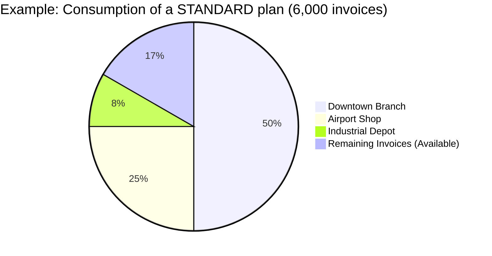

# Understanding Your Fiscalis Subscription

Welcome to Fiscalis! Our mission is to simplify your tax compliance in the DRC. To support your company's growth, we have designed a pricing model **based on your actual business volume**, not on the number of terminals you own.

Here's everything you need to know about how your subscription works, your quotas, and managing your invoices.

---

## 1. Our Annual Plans

Fiscalis offers four plans tailored to the size of your business. Each plan includes a volume of certified invoices per year.

| Offer | Annual Subscription | Installation Fee | Included Invoice Volume | Included Terminals (MCF) |
| :--- | :--- | :--- | :--- | :--- |
| **ESSENTIAL** | $300.00 | $300.00 | **600** invoices/year | 1 |
| **STANDARD** | $950.00 | $300.00 | **6,000** invoices/year | **Unlimited** |
| **PERFORMANCE** | $2,400.00 | $500.00 | **40,000** invoices/year | **Unlimited** |
| **ENTERPRISE** | On quote | > $1,000.00 | **> 40,000** invoices/year | **Unlimited** |

:::info Installation Fee (Optional)
The installation fee is paid only once when creating your account. It covers the setup of your space and the generation of your Fiscalis security keys.
:::

---

## 2. The Superpower of the NIF: Pooling

This is one of the greatest advantages of Fiscalis. Your subscription is linked to your **Tax Identification Number (NIF)**, not to a physical machine.

**What does this mean for you?**
If you have multiple branches or points of sale, you don't need to pay for a subscription for each one! Starting with the **STANDARD** plan, you can connect an **unlimited** number of cash registers or software. All your branches will simply draw from the same "common pot" of invoices.

## 3. What happens if I exceed my quota? (Top-Ups)

Is your business growing faster than expected? Congratulations! Fiscalis will never force you to buy a full new subscription during the year.

If you reach your annual limit, your software will notify you. You can then purchase a Top-Up to continue invoicing immediately:

- If you are on ESSENTIAL: + 500 invoices for $80
- If you are on STANDARD: + 1,000 invoices for $130
- If you are on PERFORMANCE: + 5,000 invoices for $600

### How to request it?
Directly from the portal, a button will allow you to request a top-up. Once the payment is made to our commercial partner (Altairon), your invoices will be unlocked instantly.

## 4. Invoice Rollover: Never lose what you've paid for

Unlike many services, at Fiscalis, your unused invoices are not lost!

If you reach the end of your subscription year and you have invoices left, we will automatically transfer them to your next year upon renewal.

:::tip Concrete example of rollover
You have subscribed to the STANDARD plan (6,000 invoices). On your contract's anniversary date, you have only used 4,500.
Upon your annual renewal, the remaining 1,500 invoices are added to your new plan. You will therefore start your new year with 7,500 available invoices!
:::

*Note: In case of a downgrade to a lower plan, the rollover is capped at the size of your new plan.*

## 5. How to renew or change your plan?

- **Renewal**: Thirty (30) days before your license expires, a notification will appear in your system. You just need to validate the renewal to extend your access for another year and benefit from the rollover of your invoices.

- **Plan Change (Upgrade)**: You can switch to a higher plan at any time (for example, from Essential to Standard) if your business volume requires it. All your unused invoices will be fully retained and added to your new balance.

For any commercial questions or requests to change your offer, the **Altairon** team is at your entire disposal.